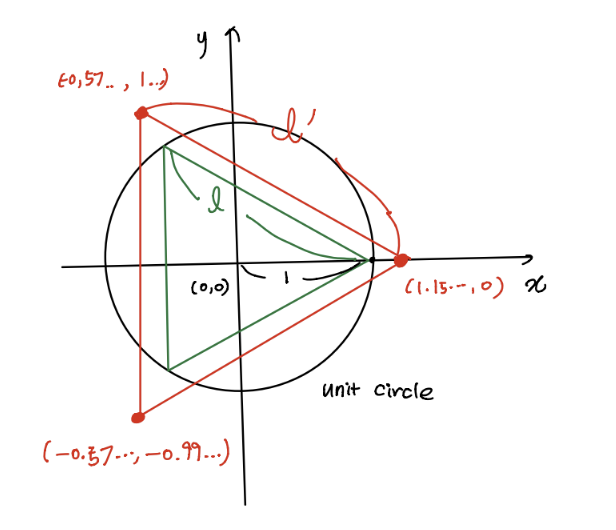

# simple_shapes ROS package
### CS269 Multi Robot Systems / 2021 Spring / PA-1
### Mingi Jeong / mingi.jeong.gr@dartmouth.edu


# 
## 1. General
* This package achieves simple shapes drawing for regular polygons by user inputs by rosparam and launch arguments.
* One launch file can run all the programs to achive and monitor the task.
* It is robust to achieve drawing regular polygons with any number (>=3) of sides, length, and direction either in counter-clockwise or clockwise.
* The package consist of the main running node in 'nodes' folder and essential code implementations (__simple_shapes.py__, __aux_function.py__) such as functions and class in 'src/simple_shapes' folder to make it re-usable. 

## 2. Method
1. Assumption
    * The robot starts at the position (0,0) on 2D plane with yaw 0.
    * The robot goes to the first vertex and matches the heading along the first side. In other words, I am not assuming the robot starts at one of the vertices. 
    * After the first vertex reach and heading match, the robot start the main task by __move_forward__ and __rotation_in_place__, based on the calculations from the characteristics of regular polygons. 

2. Start
    * The task is initiated with just one launch file with arguments. For example, if you want to run quadrilateral with side length 4 and following in counter clock-wise,
        ```
        roslaunch simple_shapes simple_shapes.launch side_number:=4 side_length:=2 dir_counter_clock:=True
        ```
    * Withoutthe argument, the default is 3, 2, True for each argument. These arguments are passed into the node via rosparam server. 

3. Finding where to go
    * In aux_function, I find coordinates of regular polygons by using unit radius (1) and angle relationship. 

        ```
        coordinate_list = []
        for i in range(side_number):
            (radius * ratio * math.cos(2*math.pi * i/side_number),   
             radius * ratio * math.sin(2*math.pi * i/side_number))
        ```
    * Here, the ratio is based on the polygon's geometric similarity with its center of gravity located in (0,0). It is calculated by _l_ vs _l'_ where _l_ is the side length by unit radius circle and _l'_ is the intended side length.

    <div style="text-align:center">
    </div>

    * _l_ is caluclated by cosine no. 2 rule. 
    An example for hexagon is as follows:
    <div style="text-align:center">
    </div>

    * To make the robot return, the first vertex will be appended in the end. If turning direction for clock-wise, the coordinate list is returned as a reverse one.
    * These coordinates will be used for error calculation at each vertex.

4. Drawing task
    * The robot goes to the first vertex (by distance comparison) located along x-axis (no. 1) in the figure.
    * Then, the robot finds angle to match the heading along the first side (by using __check_vector_angle__) and start turning prior to no.2.
    * The robot moves along the side (by side_length input) and turn in place (by exterior angle calculation by 2*math.pi /side_number). For example, at each vertex of pentagon, the rotation angle will be 72 degrees as the interior angle is 108 degrees. 
    * Turning direction flag will determine the sign of angular velocity.
    <div style="text-align:center">
    </div>

5. Error 
    * At each vertex, the robot calculates an error as __Euclidean distance__ between the current odom x,y and the intended coordinate x,y. 
    * The calculated error is published via __error__ topic with _std_msgs/Float32_ type. I am also printing the information on the terminal.

## 3. Evaluation
Please see the additionl material videos.

1. Task performance
    * My code performs well with being well organized and commented I think.
    * It is robust in achieving regular polygons with any number of sides and length. 
    * You can see the visualization together with rviz running automatically. 
     
    

    <8 side performance in counter clock-wise (left) 5 side performance with error publish in clock-wise (right); both side length 2m>

2. Error discussion
    * Source of error can be diverse.
        * Dynamic and physics model of the robot: control of the robot is not always sharp as our intention due to friction, inertia, etc.
        * Frequency-related factors such as rostopic rate, linear and angular velocity can affect the error. I observed the faster the velocity, the more error in general. 
        * Odom is weak to drifting and odom data themselves include noise. Therefore, even when the robot is sharply at (0,0), the value is not like that and oscilliating if we check __rostopic echo odom__.
    * I empirically reduced error by using linear and angular velocity as 0.1 and rate as 20 Hz. It has also tendency of more error in some side length. See the video for pentagon as side length 1 and the screenshot above for side length 2.